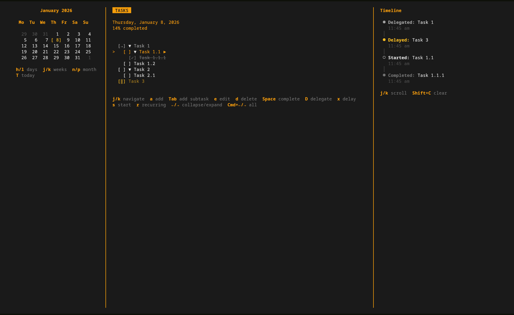

# Ritual



Ritual is a modern, terminal-based task logger and time tracker built with TypeScript, React, and Ink. It features a three-pane layout designed for efficiency and keyboard-centric workflows, allowing you to manage nested tasks and track your time without ever leaving the terminal.

## Features

- **Three-Pane Layout**: Seamlessly switch between Calendar, Tasks, and Timeline views.
- **Calendar View**: Navigate through months and days to visualize task distribution and select specific dates.
- **Infinite Nesting**: Break down complex projects with support for infinitely nested subtasks.
- **Activity Timeline**: Automatically logs every action (start, complete, delegate) with precise timestamps.
- **Task States**: Track tasks through 'todo', 'completed', 'delegated', and 'delayed' states.
- **Extensible Themes**: Comes with built-in dark and light themes (plus 20+ community themes like Catppuccin, Nord, Dracula).
- **Local Persistence**: Data is saved locally in JSON format for easy backup, portability, and privacy.
- **Cross-Machine Sync**: Export and import your data across machines using temporary cloud storage with secure 8-character codes.

## Installation & Running

### Prerequisites

- Node.js (v16+ recommended)
- pnpm

### Setup

```bash
# Install dependencies
pnpm install

# Run in development mode (with hot reload)
pnpm dev

# Build and start production version
pnpm build
pnpm start
```

## Keyboard Shortcuts

Ritual is designed to be used entirely without a mouse.

### Global Navigation

- `1` / `2` / `3`: Switch directly to Calendar / Tasks / Timeline panes
- `Tab` / `Shift+Tab`: Cycle through panes
- `?`: Toggle help dialog
- `q`: Quit application

### Calendar Pane

- `j` / `k` (or `↓` / `↑`): Navigate weeks
- `h` / `l` (or `←` / `→`): Navigate days
- `n` / `p`: Next / Previous month
- `Enter`: Select date

### Tasks Pane

- `a`: Add new task
- `e`: Edit task title
- `d`: Delete task
- `Space`: Toggle completion status
- `s`: Start task (sets start time)
- `D`: Mark as delegated
- `x`: Mark as delayed/cancelled
- `Tab`: Indent task (convert to subtask)
- `Shift+Tab`: Unindent task
- `Enter`: Expand/Collapse subtasks

### Timeline Pane

- `j` / `k`: Scroll through activity history
- `t`: Toggle theme (Dark/Light)

## Data Storage

Your data is stored locally in a human-readable JSON file. This allows for easy backups or manual editing if necessary.

- **macOS**: `~/Library/Application Support/ritual/data.json`
- **Linux**: `~/.local/share/ritual/data.json` (or `$XDG_DATA_HOME`)
- **Windows**: `%APPDATA%\ritual\data.json`

## Cross-Machine Data Sharing

Ritual now supports exporting and importing your data across machines using a temporary cloud-based storage solution. This feature is perfect for syncing your tasks between your work laptop and home desktop, or sharing a snapshot with a colleague.

### How It Works

The sharing functionality uses a dedicated server (see `server/` directory) that:

- **Temporarily stores** your data in Redis (Upstash)
- **Generates a secure 8-character code** for each export
- **Expires data after 5 minutes** (TTL: 300 seconds)
- **Hashes codes with bcrypt** for security
- **Rate limits requests** (100 requests per 15 minutes)

### Usage

#### Exporting Data

```bash
ritual export
```

This will:

1. Upload your current data to the server
2. Generate a unique 8-character code
3. Display the code and expiration time

Example output:

```
Data exported successfully!
---------------------------
Secret Key: aB3dE7fG
Expires: 1/4/2026, 7:45:30 PM
---------------------------

Run 'ritual import' on another machine and enter this key to sync your data.
```

#### Importing Data

```bash
ritual import
```

This will:

1. Prompt you to enter the 8-character code
2. Fetch the data from the server
3. Ask whether to **replace** or **merge** with existing data
   - **Replace (r)**: Overwrites all local data
   - **Merge (m)**: Combines remote data with local, preserving both

Example workflow:

```
$ ritual import
Enter your secret key: aB3dE7fG

Data found! Do you want to (r)eplace existing data or (m)erge with it? [r/m]: m
Data successfully merged.
```

### Server Details

- **Health check endpoint**: `GET /api/health`
- **Export endpoint**: `POST /api/data/export`
- **Import endpoint**: `POST /api/data/import`

For development or self-hosting, see the `server/` directory for complete setup instructions including:

- Express.js + TypeScript server
- Upstash Redis integration
- Docker deployment configuration
- Swagger API documentation

**Note**: Data is stored temporarily (5 minutes) for security and privacy. This is not a backup solution—it's designed for quick transfers between machines.

## Tech Stack

- **UI Framework**: React + Ink
- **Language**: TypeScript
- **State Management**: React Context
- **Date Handling**: date-fns
- **Persistence**: File System (JSON)

## Development & Code Quality

### Testing

```bash
pnpm test          # Run tests
pnpm test:coverage # Run tests with coverage report
```

### Code Formatting

Code is automatically formatted with Prettier on every commit.

```bash
pnpm format        # Format all files
pnpm format:check  # Check formatting without modifying files
```

### Local SonarQube Analysis

This project uses SonarQube for local code quality analysis (runs in pre-commit hook).

**To run SonarQube locally:**

```bash
# Start SonarQube server (Docker)
docker run -d -p 9000:9000 --name sonarqube sonarqube

# Initialize server at http://localhost:9000 (admin/admin)
# Create a new project and generate a token

# Add token to environment
export SONAR_TOKEN=your_token_here

# Run analysis
pnpm sonar
```

**Pre-commit Hook:**

- Runs `lint-staged` to format staged files with Prettier
- Attempts to run SonarQube scanner (non-blocking if server unavailable)

Configuration: See `sonar-project.properties`

## Author

Created by [Surani Harsh](mailto:harshsurani00@gmail.com).
